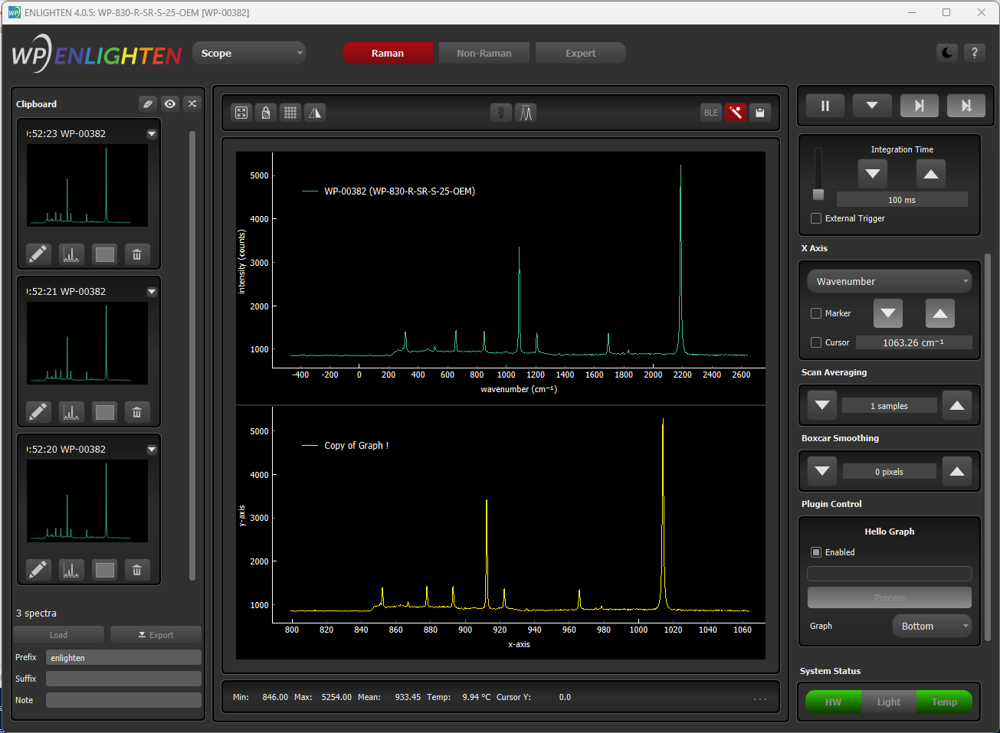

# Enlighten Plug-Ins

ENLIGHTEN's plug-in architecture is designed to allow end-users to write simple 
Python modules that can be dynamically loaded by ENLIGHTEN and run directly 
during spectral processing.  This allows users to manipulate spectra any way they
wish, including seeing their processed spectra appear on the graph alongside (or
instead of) ENLIGHTEN's own.

Python is a powerful data-processing language, and plug-ins are free to use 
popular mathematical libraries and frameworks, including Numpy, Pandas and SciPy.
In fact, Pandas dataframes may be output and displayed directly on the ENLIGHTEN
GUI.

## Quick Start




```python
from EnlightenPlugin import *

class hello_graph(EnlightenPluginBase):

    def get_configuration(self):
        self.name = "Hello Graph",
        self.has_other_graph = True,
        self.series_names = self.my_series.keys(),
        self.x_axis_label = "x-axis",
        self.y_axis_label = "y-axis",

    def process_request(self, request):
        x_values = self.get_axis()
        y_values = request.processed_reading.get_processed()
        self.plot(x=x_values, y=y_values, title="Copy of Graph !", color="teal")
```

## Advanced use

See EnlightenPlugin.py for more information about these functions and parameters.

### inline parameters
- self.name
- self.is_blocking
- self.has_other_graph
- self.table
- self.x_axis_label
- self.y_axis_label

### helper functions
- get_axis
- to_pixel
- wavelength_to_pixel
- wavenumber_to_pixel
- area_under_curve

### api functions
- field
- get_widget_from_name
- plot

## More Information

There are two sides to our plug-in architecture:

- "external" (for ENLIGHTEN users and plug-in authors)
- "internal" (for ENLIGHTEN developers and maintainers)

## External

Classes of interest to plug-in authors are in the EnlightenPlugin module, 
especially:

- EnlightenPlugin.EnlightenPluginBase

EnlightenPlugin is a single Python file stored in pluginExamples in the source distribution, and installed to EnlightenSpectra/plugins on Windows.

## Internal

The internal plug-in architecture is implemented in the enlighten.Plugins 
namespace, especially:

- enlighten.Plugins.PluginController.PluginController
- enlighten.Plugins.PluginWorker.PluginWorker
- enlighten.Plugins.PluginModuleInfo.PluginModuleInfo
- enlighten.Plugins.PluginFieldWidget.PluginFieldWidget
- enlighten.Plugins.PluginGraphSeries.PluginGraphSeries
- enlighten.Plugins.EnlightenApplicationInfoReal.EnlightenApplicationInfoReal
- enlighten.Plugins.PluginValidator.PluginValidator
- enlighten.Plugins.TableModel.TableModel

Some of the external symbols are now handled internally.

- EnlightenPlugin.EnlightenPluginConfiguration
- EnlightenPlugin.EnlightenPluginField
- EnlightenPlugin.EnlightenPluginDependency
- EnlightenPlugin.EnlightenApplicationInfo
- EnlightenPlugin.EnlightenPluginRequest
- EnlightenPlugin.EnlightenPluginResponse

## Backlog

### Testing

- PeakFinding w/o excitation (no wavenumbers)
- vignetting
- interpolated

### Misc

- should probably let the "Save" button save measurements graphed on the Plugin 
  "other graph" (.csv and thumbnails), and let thumbnails be added as traces
- for every graph series (not on other\_graph), add "[x] (color) name"
- consider graphing Pandas
- EnlightenSeriesConfiguration
    - graph (main, other)
    - type (line, xy)
    - color
    - pen (color, dash, size)
    - symbol (https://www.geeksforgeeks.org/pyqtgraph-symbols/)
    - secondary y-axis
- consider persistence 

### R

It would be nice to use rpy2 to be able to run R functions directly, rather than
"shelling-out".  We should be able to generate a sample rpy2 plugin NOW, since:

- we're now 64-bit native (yay)
- rpy2 now [supports Python 3.9 and 3.10](https://github.com/rpy2/rpy2/pull/853)
